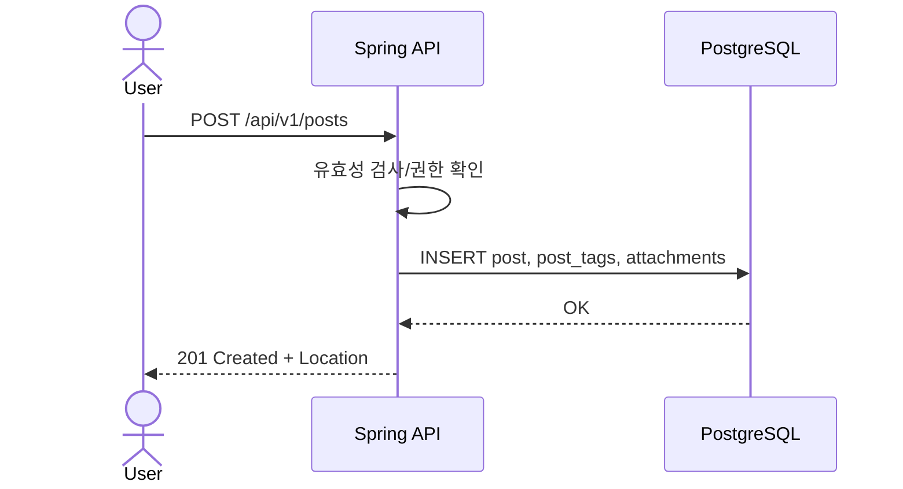

# 프로젝트 개요

* **프로젝트명:** (가칭) BoardCraft
* **목표:** 학습과 포트폴리오에 적합한, 실서비스 수준의 게시판 백엔드를 **SDLC(요구사항→설계→구현→검증→배포→운영)** 절차에 따라 구현한다.
* **핵심 가치:** 단순 CRUD가 아닌, 확장성·보안·관측성·운영 자동화를 포함한 **프로덕션 품질** 확보.

---

## 1. 이해관계자 & 페르소나

1. **Guest(비회원)**: 글/댓글 열람, 검색 가능. 신고 가능. 작성은 제한.
2. **User(일반 사용자)**: 글/댓글/이미지 업로드, 본인 글 수정·삭제, 북마크/구독, 알림 수신.
3. **Moderator**: 신고 처리, 게시물 숨김, 태그/카테고리 정리, 유저 제한(제한 기간).
4. **Admin(관리자)**: 시스템 설정, 권한 부여, 전역 공지, 감사 로그 열람.
5. **System**: 백그라운드 잡(인덱싱, 알림 발송, 이미지 썸네일링 등).

---

## 2. 범위(Scope)

### 2.1 Must-Have (MVP)

* 회원가입/로그인(이메일+비밀번호)
* 게시글 CRUD(제목, 본문 Markdown, 카테고리 1개, 태그 N개, 첨부파일)
* 댓글/대댓글(1-레벨 대댓글)
* 목록 페이지네이션/정렬/키워드 검색(제목/본문/태그/작성자)
* 권한/역할(RBAC): GUEST/USER/MOD/ADMIN
* 소프트 삭제(복구 가능 보관함)
* 기본 모더레이션(신고/숨김/블럭)
* 관측성: 구조적 로그, 요청 추적 ID, 기본 메트릭(요청수, p95, 에러율)

### 2.2 Should-Have

* 알림(구독한 글/작성자 새 글/댓글) – 이메일/웹훅
* 좋아요/리액션(게시글/댓글)
* 초안/예약발행
* 첨부 이미지 자동 WebP 변환, 썸네일 생성
* 감사 로그(Audit) + 관리자 대시보드 요약

### 2.3 Could-Have

* 다국어(i18n)
* 텍스트 검색 고도화(Elasticsearch/OpenSearch 연동)
* 레이트 리미팅(사용자/IP/엔드포인트 단위)
* 웹소켓 실시간 알림

### 2.4 Wont-Have (v1 제외)

* WYSIWYG 협업 편집(동시 편집)
* 포인트/배지 등 게이미피케이션

---

## 3. 비기능 요구사항(NFR)

* **성능:** 목록 조회 p95 < 200ms(캐시 적중 시), 단건 API p95 < 150ms. 동시 200 RPS에서 에러율 < 1%.
* **가용성:** 단일 AZ 장애 시 자동 복구(무중단 배포는 v2). 헬스체크/리드니스
* **보안:** OWASP Top 10 대응, 비밀번호 Bcrypt, JWT 만료/갱신, CSRF 방어(세션 시), 입력 검증
* **확장성:** 수평 확장 가능(무상태 API), 이미지/S3 등 외부화
* **관측성:** OpenTelemetry(추후), Prometheus 메트릭, 로그→ELK/CloudWatch
* **데이터 보호:** PII 최소 수집, 삭제·익명화 정책

---

## 4. 유스케이스(요약)

* UC-1 회원이 글을 등록한다(초안→발행)
* UC-2 회원이 글에 댓글을 단다(대댓글)
* UC-3 사용자가 글을 검색/필터링한다(키워드/태그/카테고리/작성자)
* UC-4 모더레이터가 신고된 글/댓글을 숨김 처리한다
* UC-5 관리자가 역할을 부여하고 감사 로그를 조회한다
* UC-6 사용자가 작성자/글을 구독하고 알림을 수신한다



---

## 5. 데이터 모델(초안 ERD)

RDBMS **PostgreSQL** 기준. 

UUID PK 권장.

erd.puml을 통해 확인할 것.

---

## 6. API 스펙(초안)

버전: `/api/v1` (URI 버저닝)

* **Auth**

    * `POST /auth/register` (이메일 인증 옵션)
    * `POST /auth/login` → 세션로그인 방식
* **Posts**

    * `GET /posts?query&tag&category&author&page&size&sort`
    * `POST /posts` (초안/발행 플래그)
    * `GET /posts/{slug}`
    * `PATCH /posts/{id}` / `DELETE /posts/{id}`(소프트 삭제)
    * `POST /posts/{id}/reactions` / `DELETE /posts/{id}/reactions/{type}`
* **Comments**

    * `GET /posts/{id}/comments`
    * `POST /posts/{id}/comments` (parent\_id로 대댓글)
    * `PATCH /comments/{id}` / `DELETE /comments/{id}`
    * `POST /comments/{id}/reactions`
* **Taxonomy**

    * `GET /categories`, `POST /categories`
    * `GET /tags?query=`, `POST /tags`
* **Moderation** (MOD/ADMIN)

    * `POST /moderation/reports` (신고 생성)
    * `POST /moderation/posts/{id}/hide`
    * `POST /moderation/users/{id}/restrict` (기간)
* **Subscriptions/Notifications**

    * `POST /subscriptions` / `DELETE /subscriptions/{id}`
    * `GET /notifications` (읽음 처리)
* **Attachments**

    * `POST /uploads/images` (S3 presigned URL 또는 서버 업로드)

**에러 포맷 제안서**

```json
{
  "timestamp": "2025-09-02T12:34:56Z",
  "traceId": "...",
  "path": "/api/v1/posts",
  "error": {
    "code": "POST_NOT_FOUND",
    "message": "게시글을 찾을 수 없습니다."
  },
  "validation": {
    "title": "must not be blank"
  }
}
```

---

## 7. 아키텍처 & 기술 스택

* **Runtime:** Java 21, Spring Boot 3.3+, Spring Web, Spring Security, Spring Data JPA, Validation, Springdoc(OpenAPI)
* **DB:** PostgreSQL 16, 마이그레이션 Flyway
* **Cache:** Redis(세션/토큰 블랙리스트/조회 카운터)
* **스토리지:** S3 호환(이미지/첨부) – WebP 변환(서버 또는 Lambda)
* **빌드/테스트:** Gradle, Testcontainers, JUnit5, RestAssured, Spring Cloud Contract(선택)
* **관측성:** Micrometer + Prometheus, JSON 로그(ELK)
* **배포:** Docker/Compose → (선택) K8s, GitHub Actions CI

---

## 8. 수용 기준(Acceptance Criteria) 샘플

* **스토리:** “회원은 글을 발행할 수 있다.”

    * 로그인 사용자는 `POST /posts`로 `title>=3`, `content>=10` 유효성 만족 시 201 Created
    * `slug`는 자동 생성(중복 시 일련번호 부여)
    * 초안(`is_published=false`)은 목록 기본 검색에서 제외
    * 발행 시 `published_at` 저장, 이벤트 발행(Notification)

* **스토리:** “사용자는 글을 태그로 필터링할 수 있다.”

    * `GET /posts?tag=java&tag=spring` → 두 태그 교집합 결과, 페이지네이션 메타 포함

---

## 9. 위험(Risks) & 완화 전략

* **스팸/악성 업로드** → 파일 확장자/크기 제한, AV 스캔(선택), presigned URL, Rate limit
* **검색 성능 저하** → GIN 인덱스, 캐시, 장기적으로 OpenSearch 연계
* **데이터 정합성** → 트랜잭션 경계 명확화, 이벤트 일관성(outbox 패턴 고려)

---

## 10. 마일스톤

프로젝트에 많은 시간을 쏟을 수 없으므로 매일 30분씩 개발하는 것을 기준으로 시간 계획 작성

### M1 (약 2주) — 요구사항 및 프로젝트 골격
- 요구사항 명세서 및 추적성 매트릭스 확정
- ERD 및 OpenAPI 스켈레톤 정의
- Gradle 및 Spring Boot 초기 세팅
- Flyway V1__init.sql 작성
- Hello World Controller와 데이터베이스 연결 확인  
  **결과:** 기본 구조와 실행 가능한 프로젝트 확보

---

### M2 (약 3주) — 인증 및 사용자 관리
- 회원가입 및 로그인 (세션 기반)
- 비밀번호 해시 저장 (BCrypt)
- 입력 검증 적용
- RBAC 역할 체계 도입 (GUEST, USER)
- 사용자 정보 조회 API 제공  
  **결과:** 사용자 계정 생성 및 로그인 기능 확보

---

### M3 (약 3주) — 게시글 CRUD 및 소프트 삭제
- Post 엔티티 및 Repository 구현
- 게시글 작성, 조회, 수정, 삭제 API
- Slug 자동 생성 규칙 적용
- Thymeleaf 기반 게시글 목록 및 상세 화면 프로토타입  
  **결과:** 게시글 작성부터 삭제까지의 주요 흐름 구현

---

### M4 (약 3주) — 댓글 및 기본 모더레이션
- Comment 엔티티 및 API 구현
- 1레벨 대댓글 처리
- 댓글 소프트 삭제 처리
- 신고 및 숨김 기능 구현 (모더레이터 권한)  
  **결과:** 댓글 작성 기능과 최소한의 모더레이션 기능 확보

---

### M5 (약 2주) — 관측성 및 배포
- Spring Actuator Health 및 Metrics 설정
- 구조적 로그 및 TraceId 기록
- Dockerfile 및 docker-compose.yml 작성
- GitHub Actions CI 구성 (빌드 및 테스트)  
  **결과:** 기본적인 관측성 도입과 CI/CD 파이프라인 확보

---

### M6 (선택 사항, 여유 시) — 기능 확장
- 게시글 및 댓글 리액션
- 첨부 이미지 업로드 및 WebP 변환
- 구독 및 알림 기능  
  **결과:** 추가 기능을 통한 사용자 경험 강화

---

### 개발 속도 및 예상 일정
- 하루 개발 가능 시간: 30분
- 주당 개발 시간: 약 3.5시간
- 마일스톤 1개 예상 소요: 2~3주
- M1~M5 전체 예상 소요: 약 4~5개월

---

## 11. 테스트 전략

* **단위:** 도메인 서비스/밸리데이션
* **통합:** JPA/리포지토리(Testcontainers: Postgres/Redis)
* **API 계약:** RestAssured + 스냅샷/컨트랙트
* **성능:** k6/Gatling으로 RPS·p95 측정, 임계치 CI 게이트

---

## 12. 오픈 이슈(To Decide)

* 카테고리 구조: 트리 vs 평면 + path 문자열(초안은 path)
* 댓글 구조: 1-레벨 대댓글 유지 vs 무한 트리(초안은 1-레벨)
* 알림 채널: 이메일 기본, 웹훅/FCM 옵션
* 검색: DB Like/TSVector 시작 → OpenSearch 전환 기준치

---

### 다음 단계 제안

1. 위 초안을 기준으로 **Must-Have 범위 확정**(불필요 항목 제거/추가)
2. **클래스 다이어그램(도메인 서비스/엔티티 경계)** 세분화
3. **API 명세서(요청/응답 DTO, 예외코드 표)** 확정 → OpenAPI 문서 스켈레톤 생성
4. Flyway 초기 스키마 작성 & Testcontainers 그린 빌드
t