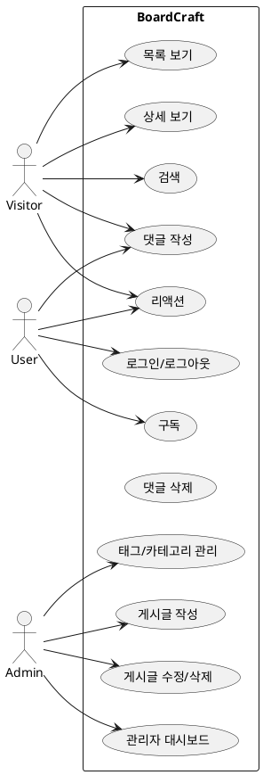
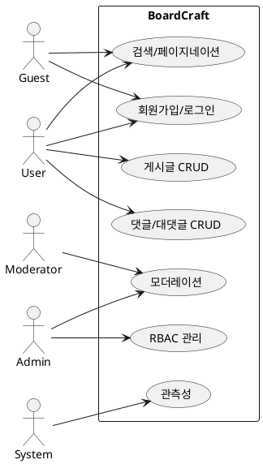

# BoardCraft — Use Case Catalog

> 범위: 공개 블로그/게시판(Posts, Categories, Tags), 댓글, 리액션, 구독, 관리(어드민) 전반. 데이터베이스와 ERD는 현재 정의된 스키마를 기준으로 함. 인증은 이메일 기반을 가정.

## 1) 주요 액터

1. **Guest(비회원)**: 글/댓글 열람, 검색 가능. 신고 가능. 작성은 제한.
2. **User(일반 사용자)**: 글/댓글/이미지 업로드, 본인 글 수정·삭제, 북마크/구독, 알림 수신. (다이어그램에서 액터를 따로 분리하지 않거나 명시되어 있지 않을 경우 전체 사용자를 의미함.)
3. **Moderator**: 신고 처리, 게시물 숨김, 태그/카테고리 정리, 유저 제한(제한 기간).
4. **Admin(관리자)**: 시스템 설정, 권한 부여, 전역 공지, 감사 로그 열람.
5. **System**: 백그라운드 잡(인덱싱, 알림 발송, 이미지 썸네일링 등).

* **알림 시스템(Notification Service)**: 구독자에게 새 글/답글/공지 알림 전달(이메일/웹푸시 가정).
* **파일 스토리지(File Service)**: 이미지 업로드/변환(WebP), 원본/파생 저장.
* **인증 제공자(Auth Provider)**: GitHub/Google/Kakao 등 외부 OAuth2.

---

## 2) 핵심 유스케이스 목록(요약)

1. **UC-01** 게시글 목록 보기 (필터/정렬/페이지네이션)
2. **UC-02** 게시글 상세 보기 (슬러그 라우팅)
3. **UC-03** 게시글 검색 (제목/전문/태그/카테고리)
5. **UC-04** 회원 가입
6. **UC-05** 회원 탈퇴
4. **UC-06** 회원 인증 (로그인/로그아웃)
7. **UC-07** 게시글 작성 (이미지 업로드 포함)
8. **UC-08** 게시글 수정/삭제 (버전/임시저장/발행시간)
9. **UC-09** 댓글 작성 (익명 닉네임+비밀번호 / 로그인 사용자)
10. **UC-10** 댓글 삭제 (작성자 비밀번호 또는 관리자)
11. **UC-11** 리액션 남기기 (좋아요/이모지, 주제별)
12. **UC-12** 구독하기 (게시글/카테고리/전체, 알림)
13. **UC-13** 태그/카테고리 관리 (관리자)
14. **UC-14** 관리자 대시보드 (트래픽/에러/상태)

> 부가 UC (선택): 초안/자동저장, 미디어 라이브러리, 신고/스팸, 링크 프리뷰, 방문자 통계 공개 위젯 등.

---

## 3) 상세 유스케이스

### UC-01 게시글 목록 보기

* **Primary Actor**: 방문자, 사용자
* **Goal**: 최신 게시글을 조건별로 빠르게 탐색
* **Level**: 사용자 과업
* **Preconditions**: 게시글이 `is_published=true` 상태로 존재
* **Trigger**: 홈/리스트 페이지 접속
* **Main Success Scenario**

    1. 사용자가 목록 페이지에 접근한다.
    2. 시스템은 `is_published=true` 조건으로 페이지네이션+정렬(기본 `published_at DESC`)된 목록을 반환한다.
    3. 사용자는 카테고리/태그/키워드/기간/정렬 기준을 선택할 수 있다.
    4. 시스템은 선택된 조건에 따라 인덱스를 활용해 응답한다.
* **Extensions**

    * 2a. 결과 없음 → “검색 조건을 완화하세요” 메시지
    * 3a. 과도한 페이지 요청 → 마지막 페이지로 보정
* **Non‑Functional**: 첫 페이지 TTFB ≤ 300ms(캐시 적중 시 100ms), 페이지 사이즈 기본 20, 슬러그/정렬 인덱스 사용
* **Open Questions**: 인기순 정렬 정의(조회수? 리액션? 가중치?)

### UC-02 게시글 상세 보기

* **Primary Actor**: 방문자, 사용자
* **Goal**: 슬러그로 원클릭 접근, 가독성 높은 뷰
* **Preconditions**: 대상 포스트가 발행 상태
* **Trigger**: `/posts/{slug}` 요청
* **Main**

    1. 사용자가 슬러그 URL로 접근.
    2. 시스템이 슬러그 인덱스로 포스트를 조회하고 본문/메타(카테고리/태그/작성일)를 렌더링.
    3. 관련 포스트(태그 기반)와 리액션/댓글 영역을 함께 제공.
* **Extensions**: 2a. 미발행/삭제 → 404/410 처리, sitemap/SEO 제어
* **Non‑Functional**: 본문 렌더링 ≤ 200ms, 이미지 LQIP/지연로딩

### UC-03 게시글 검색

* **Primary Actor**: 방문자, 사용자
* **Goal**: 키워드 기반 빠른 검색
* **Preconditions**: 인덱스 구성(title, head/main content, tag.name, category.path)
* **Trigger**: 검색 입력 제출
* **Main**

    1. 사용자가 키워드를 입력하고 제출.
    2. 시스템이 인덱스를 활용해 `is_published=true`로 제한하고 매칭 결과를 반환.
    3. 사용자는 정렬(최신/관련도), 필터(태그/카테고리/기간)를 적용.
* **Extensions**: 2a. XSS/SQLi 방어(인코딩/바인딩), 3a. 오타 보정(선택)
* **Non‑Functional**: p95 검색 응답 ≤ 300ms(캐시/서브인덱스 활용)

### UC-04 회원 인증(로그인/로그아웃)

* **Primary Actor**: 사용자
* **Goal**: OAuth2로 간편 로그인, 최소 정보 수집
* **Preconditions**: OAuth 클라이언트 등록, 리디렉션 URI 설정
* **Trigger**: 로그인 버튼 클릭
* **Main**

    1. 사용자가 제공자(GitHub/Google/Kakao)를 선택.
    2. 시스템이 OAuth2 Authorization Code Flow 진행.
    3. 최초 로그인 시 프로필 최소화 생성(닉네임, 아바타 URL 등).
    4. 세션/토큰 발급 후 리다이렉트.
* **Extensions**: 2a. 취소/거부 → 로그인 페이지 유지, 3a. 중복 계정 병합 정책
* **Security**: CSRF/OIDC state/nonce, HTTPS 강제

### UC-05 게시글 작성(이미지 업로드 포함)

* **Primary Actor**: 관리자
* **Goal**: 초안→발행까지 끊김없는 작성 경험
* **Preconditions**: 관리자 권한, 이미지 업로드 정책(WebP 변환, SVG 예외)
* **Trigger**: “새 글 작성” 클릭
* **Main**

    1. 관리자가 제목/슬러그 자동 생성, 본문/요약/카테고리/태그 입력.
    2. 이미지 업로드 시 서버가 UUID 파일명과 `/post/날짜/파일` 경로로 저장, WebP 변환(SVG 제외).
    3. 초안 저장(autosave), 미리보기.
    4. 발행 시 `is_published=true`, `published_at` 설정.
* **Extensions**: 2a. 대용량 이미지 → 리사이즈, 4a. 예약발행(미래 `published_at`)
* **Non‑Functional**: 에디터 저장 p95 ≤ 150ms, 이미지 처리 백그라운드 워커

### UC-06 게시글 수정/삭제

* **Primary Actor**: 관리자
* **Goal**: 안전한 수정/삭제와 히스토리 관리(선택)
* **Preconditions**: 관리자 권한
* **Trigger**: 글 상세의 “수정/삭제” 클릭
* **Main**

    1. 관리자가 메타/본문 변경.
    2. 시스템이 슬러그 충돌 검증 및 인덱스 갱신.
    3. Soft delete 또는 영구 삭제 정책 수행.
* **Extensions**: 3a. 슬러그 변경 시 301 리다이렉트 테이블(선택)
* **Non‑Functional**: 동시편집 잠금(낙관적 락/버전)

### UC-07 댓글 작성(익명/로그인)

* **Primary Actor**: 방문자(익명), 사용자
* **Goal**: 익명 닉네임+비밀번호 또는 로그인으로 댓글 작성
* **Preconditions**: 댓글 폼(닉네임, 비밀번호, 비번확인, 아바타 선택, 본문), 스팸 방어
* **Trigger**: 댓글 제출
* **Main**

    1. 사용자가 폼을 작성해 제출.
    2. 서버가 Zod(또는 백엔드 검증)로 유효성 검사.
    3. 익명은 비밀번호 해시 저장, 로그인 사용자는 사용자 ID 연결.
    4. 성공 시 목록 상단/하단에 반영, 실시간 카운트 갱신.
* **Extensions**: 2a. 스팸/빈도 제한, 3a. 이미지/링크 제한
* **Non‑Functional**: 입력\~반영 p95 ≤ 200ms, 악성어 필터(옵션)

### UC-08 댓글 삭제(비밀번호/관리자)

* **Primary Actor**: 익명 작성자, 관리자
* **Goal**: 본인 확인 후 안전 삭제
* **Preconditions**: 익명은 비밀번호 해시 매칭, 관리자는 권한
* **Trigger**: 삭제 버튼 클릭
* **Main**

    1. 익명은 비밀번호 입력 → 서버가 해시 검증.
    2. 검증 성공 시 삭제 처리(soft/hard 정책).
    3. 관리자 삭제는 이유 기록(감사로그).
* **Extensions**: 1a. 실패 누적 → 일시 차단

### UC-09 리액션 남기기

* **Primary Actor**: 방문자(쿠키/세션), 사용자
* **Goal**: 중복 방지된 간단한 반응 남기기
* **Preconditions**: `REACTIONS(subject_type, subject_id)` 인덱스, 중복 방지 키
* **Trigger**: 리액션 버튼 클릭
* **Main**

    1. 사용자가 좋아요/이모지 선택.
    2. 서버가 식별자(로그인ID 또는 익명 토큰+IP 해시 등)로 중복 여부 확인.
    3. 신규면 반영, 중복이면 토글/무시.
* **Non‑Functional**: p95 ≤ 120ms, 레이트리밋

### UC-10 구독하기(알림)

* **Primary Actor**: 사용자(로그인)
* **Goal**: 새 글/답글/공지 알림 수신
* **Preconditions**: `SUBSCRIPTIONS(subject_type, subject_id)` 인덱스, 이메일 인증 또는 웹푸시 등록
* **Trigger**: “구독” 버튼 클릭
* **Main**

    1. 사용자가 대상(전체/카테고리/특정 포스트)을 선택.
    2. 서버가 구독 레코드 생성(중복 방지).
    3. 새 이벤트 발생 시 알림 서비스가 배치/실시간 전송.
* **Extensions**: 3a. 옵트아웃 링크/토글

### UC-11 태그/카테고리 관리

* **Primary Actor**: 관리자
* **Goal**: 분류 체계의 일관성 유지
* **Preconditions**: 고유성 제약(TAGS.name unique, CATEGORIES.path unique)
* **Trigger**: 관리 UI에서 CRUD 요청
* **Main**

    1. 새 태그/카테고리 생성 시 고유성/슬러그 규칙 검증.
    2. 병합/삭제 시 참조 무결성 보장(재매핑/제한).

### UC-12 관리자 대시보드

* **Primary Actor**: 관리자
* **Goal**: 트래픽/오류/게시 주기/리액션/댓글/구독 추이 파악
* **Preconditions**: 이벤트 로깅/메트릭 적재(예: Redis/DB)
* **Trigger**: 대시보드 접속
* **Main**

    1. 오늘/주간/월간 트래픽, 인기 글 Top N, 에러율 등 카드 제공.
    2. 필터(기간/채널/카테고리) 적용.

---

## 4) 유스케이스 다이어그램(PlantUML)

---

## 5) 비기능 요구와 공통 규칙(발췌)

* **성능**: 목록/검색 p95 ≤ 300ms, 상세 ≤ 200ms, 작성/리액션 ≤ 150\~200ms.
* **보안**: OAuth2 state/nonce, CSRF 방어, 속도 제한, 입력 검증(XSS/SQLi 방지), 감사로그.
* **가용성**: 캐시(페이지/쿼리), 인덱스 설계(slug, published\_at, 복합키), 장애 시 강건성.
* **SEO/UX**: 슬러그 영속성, 301 리다이렉션(슬러그 변경 시), OpenGraph/사이트맵.

---

## 6) 향후 확장 포인트

* 초안 자동저장 주기/버전 복구
* 미디어 라이브러리(검색/태그/용량 관리)
* 신고/스팸 차단(키워드/휴리스틱)
* 알림 채널 다변화(웹푸시/이메일/텔레그램)
* 다국어 포스트(i18n)

---

## 7) 오픈 이슈(결정 필요)

1. 인기순 정렬의 정의와 가중치(조회/리액션/댓글/시간 감가).
2. 댓글 이미지/링크 허용 범위 및 모더레이션 정책.
3. 슬러그 변경 시 리디렉션 테이블 운영 여부.
4. 구독 알림 빈도(즉시/배치, 요약 메일 발송 시점).
5. 익명 댓글에 대한 레이트리밋 기준(IP/쿠키/지문).

---

### 참고

* 위 유스케이스는 현재 ERD/요구사항을 바탕으로 한 v0.1 초안입니다. 스크린 워크플로우와 API 명세에 맞춰 단계적으로 정제 예정.

## MVP Scope (v0)

* **Public Read**: 게시글 목록(페이지네이션, 최신순), 상세(슬러그), 기본 검색(제목/요약/본문 단순 키워드)
* **Content Authoring (Admin only)**: 게시글 작성/수정/삭제(발행/초안, 예약발행 선택), 이미지 업로드(웹 변환 파이프라인은 단순화 가능)
* **Classification**: 카테고리/태그 생성·연결(중복 방지, 기본 CRUD)
* **Comments**: **익명 댓글**(닉네임+비번) 작성/삭제(본인 비번 or 관리자)
* **Infra/DB**: 제안된 핵심 인덱스(slug, is\_published+published\_at, COMMENTS(post\_id, created\_at), TAGS(name), CATEGORIES(path)) 적용

> 제외(후순위): 회원 일반 로그인/OAuth, 리액션, 구독 알림, 관리자 대시보드, 정교한 인기순·추천, 미디어 라이브러리, 신고/스팸 자동화

### MVP Use Cases Only

* UC-01 **게시글 목록 보기** (MVP)
* UC-02 **게시글 상세 보기** (MVP)
* UC-03 **게시글 검색** (MVP: 단순 키워드)
* UC-05 **게시글 작성(이미지 업로드 포함)** (MVP: 기본 업로드/UUID/경로)
* UC-06 **게시글 수정/삭제** (MVP)
* UC-07 **댓글 작성(익명/로그인)** → (MVP: **익명만** 우선)
* UC-08 **댓글 삭제(비밀번호/관리자)** (MVP)
* UC-11 **태그/카테고리 관리** (MVP)

---

### Acceptance Criteria (핵심)

* **목록**: `/posts?page=1&size=20&sort=published_at,DESC` 응답 ≤ p95 300ms, `is_published=true`만 반환
* **상세**: `/posts/{slug}` 200ms 내 렌더, 미발행/삭제 → 404/410
* **검색**: 단일 키워드, 제목/요약/본문 LIKE 기반(또는 간단한 fulltext), p95 300ms
* **작성/수정/삭제**: Admin 인증 하에 동작, 발행 시 `published_at` 세팅, 슬러그 유일성 보장
* **이미지 업로드**: UUID 파일명 + `/post/YYYYMMDD/파일` 경로, SVG 예외, WebP 변환은 옵션
* **댓글(익명)**: 닉네임/비밀번호 해시 저장, 비속어·스팸 최소 검증, post별 정렬(created\_at ASC)
* **댓글 삭제**: 비밀번호 검증 성공 시 soft/hard 정책 중 택1, 관리자 강제 삭제 가능
* **분류관리**: TAGS.name, CATEGORIES.path 고유 제약 및 중복 방지

### Definition of Done (MVP)

* 주요 엔드포인트와 DB 마이그레이션(Flyway) 통과, 무중단 기동 가능
* 프로덕션 .env 템플릿, 기본 로깅/에러핸들러/보안 헤더 적용
* E2E 스모크: 목록→상세→댓글 작성/삭제→검색→관리 CRUD 그린

---

# BoardCraft — MVP Use Case Catalog

> 범위: MVP 요구사항(회원가입/로그인, 게시글 CRUD, 댓글/대댓글, 검색/페이지네이션, RBAC, 소프트 삭제, 기본 모더레이션, 관측성)【30†requirements.md†L20-L40】【31†traceability.md†L17-L30】

## 1) 주요 액터

* **게스트(GUEST)**: 로그인 없이 글/댓글 열람, 검색, 신고.
* **회원(USER)**: 글/댓글 작성·수정·삭제(본인 것), 첨부 업로드.
* **모더레이터(MOD)**: 신고 처리, 글/댓글 숨김, 사용자 제한.
* **관리자(ADMIN)**: 권한 부여, 감사 로그.
* **시스템**: 로그/메트릭 수집, 트레이스 발급.

---

## 2) 핵심 유스케이스 (MVP)

* **UC-0** 회원가입/로그인 (REQ-001)
* **UC-1** 게시글 CRUD (REQ-002, REQ-006)
* **UC-2** 댓글/대댓글 CRUD (REQ-003, REQ-006)
* **UC-3** 게시글 검색/페이지네이션/정렬 (REQ-004)
* **UC-4** 모더레이션(신고/숨김/블럭) (REQ-007)
* **UC-5** 권한/역할 관리 (REQ-005)
* **UC-6** 관측성(로그/메트릭) (REQ-008)

---

## 3) 상세 유스케이스 (요약)

### UC-0 회원가입/로그인

* **Actor**: Guest
* **Goal**: 계정 생성 및 세션/JWT 발급
* **API**: `POST /auth/register`, `POST /auth/login`
* **Success**: 회원가입/로그인 성공 시 토큰 반환
* **Alt**: 이메일 중복 409, 잘못된 비밀번호 401

### UC-1 게시글 CRUD

* **Actor**: User
* **Goal**: Markdown 글 작성/수정/삭제/조회
* **API**: `POST /posts`, `GET /posts/{slug}`, `PATCH /posts/{id}`, `DELETE /posts/{id}`
* **Notes**: Slug 자동 생성, 소프트 삭제(`is_deleted=true`)【34†traceability.md†L63-L70】

### UC-2 댓글/대댓글 CRUD

* **Actor**: User
* **Goal**: 본댓글 및 1레벨 대댓글 작성/삭제
* **API**: `POST /posts/{id}/comments`, `DELETE /comments/{id}`
* **Notes**: 삭제 시 “(작성자 삭제)” 표기【34†traceability.md†L72-L78】

### UC-3 검색/페이지네이션/정렬

* **Actor**: Guest, User
* **Goal**: 키워드/태그/카테고리/작성자 기반 조회
* **API**: `GET /posts?query&tag&category&author&page&size&sort`
* **Notes**: 기본 정렬 `published_at DESC`【34†traceability.md†L80-L84】

### UC-4 모더레이션

* **Actor**: Moderator, Admin
* **Goal**: 신고 처리 및 콘텐츠 숨김, 사용자 제한
* **API**: `POST /moderation/reports`, `POST /moderation/posts/{id}/hide`, `POST /moderation/users/{id}/restrict`
* **Notes**: 중복 신고 제한, 블럭은 기간 기반【34†traceability.md†L92-L98】

### UC-5 권한/역할 관리

* **Actor**: Admin
* **Goal**: RBAC 기반 접근 제어
* **API**: 전역 Security Filter, (예: `GET /admin/audit`)
* **Notes**: USER는 본인 글만, MOD는 신고 처리, ADMIN은 전체【34†traceability.md†L86-L90】

### UC-6 관측성

* **Actor**: System
* **Goal**: 로그/트레이스/메트릭 기록 및 노출
* **API**: `/actuator/health`, `/actuator/metrics`
* **Notes**: 모든 요청 traceId 포함, p95 < 200ms【34†traceability.md†L100-L106】

---

## 4) 유스케이스 다이어그램 (MVP)

